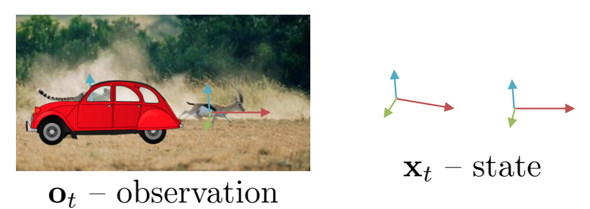

footer: Tooploox
slidenumbers: true
autoscale: true

# [fit] Reinforcement 
# [fit] Learning
## [fit] **Wprowadzenie**
Jeremi Kaczmarczyk
Rafał  Nowak
Piotr  Semberecki
## by **Tooploox AI**


^ Presenter notes

---

# Agenda:

1. Program / Agenda
2. Wprowadzenie do OpenAI
3. Gra ?????
4. Metody Monte Carlo
5. Temporal Difference Learning

---

## Cele tego szkolenia
- Zapoznanie z tematem Reinforcement Learningu
- Zapozananie z technikami 
- Stworzyć okazje do zaprogramowania podstawowych algorytmów/technik RL

### Zasady:
- Prezentacja (hangout - view) + ludzie zdalni będą zmutowani podczas rozwiązywania zadań a w przerwach pomiędzy zadaniami mamy czas na dyskusję i wtedy będziemy ich odblokowywali
- Colab - jupyter Google:
- Slack kanał #rl-workshop

---

# Reinforcement Learning

> Reinforcement Learning - jest to uczenie co zrobić - jak dopasować sytuacje do akcji aby zmaksymalizować numeryczny sygnał nagrody

- Reinforcement Learning: An Introduction 2nd ed.

--- 

# State - **Stan**

# [fit] $$\large{s}, \large{s^{\prime}}, \large{s_{t}}$$

Stan określamy symbolem $$\large{s}$$ i jest to obecna sytuacja w jakiej znajduje się środowisko. Jako $$\large{s^{\prime}}$$ oznaczamy stan będący rezultatem stanu $$\large{s}$$, natomiast $$\large{s_{t}}$$ jest to stan dla danego kroku.

^ Presenter notes

---

## Action - **Akcja**

# [fit] $$\large{a}, \large{a_{t}}$$

Znajdując się w stanie $$\large{s}$$ możemy wykonać akcję $$\large{a}$$. Akcja powoduję zmianę stanu z $$\large{s}$$ do $$\large{s^{\prime}}$$.

^ Presenter notes

---

## Reward - **Nagroda**

# [fit] $$\large{r}, \large{r_{t}}$$

Po wykonaniu akcji otrzymujemy nagrodę $$\large{r}$$ od środowiska. Nagrodę otrzymujemy po każdym kroku i niekoniecznie jest pozytywna. Projektowanie sygnału nagrody ma kluczowe znaczenie przy rozwiązywaniu problemów Reinforcement Learningiem.

^ 
- Przykłady, dlaczego nie projektujemy nagrody za stany cząstkowe, np. Szachy. Jeśli damy nagrodę za stany cząstkowe lub zbijanie figur przeciwnika, algorytm będzie optymalizował pod to nie pod wygrywanie, etc. 
- AlphaGo, nagroda za zwycięstwo, algorytm wpada na rozwiązania nie znane dotychczas.

---

# Policy - **Polityka**

# [fit] $$\large{\pi}, \large{\pi(s)}, \large{\pi(a|s)}$$


Polityka definiuje zachowanie w danym momencie. Jest to funkcja parametryzowana zwykle stanem lub parą stan-akcja. W przypadku prostych problemów jest to zwykle słownik. Zwraca akcję którą agent powinien wykonać w danym stanie albo prawdopodobieństwa wykonania każdej z akcji.

^ Presenter notes

--- 

## Value - **Wartość**

# [fit] $$\large{v_{\pi}(s)}, \large{q_{\pi}(s, a)}$$

Wartość określana jest w stosunku do danej polityki $$\large{\pi}$$. Określana jako $$\large{v}$$ jeśli jest to wartość dla stanu, albo $$\large{q}$$ jeśli dla pary stan-akcja.    Jest to numeryczna wartość określająca jak dobrze jest być w danym stanie albo inaczej jaka jest średnia skumulowana nagroda możliwa w danym stanie lub dla danej pary stan-akcja.

^ Presenter notes

---

# Agent - Środowisko


^ Presenter notes

---

# Taxi

*  `:` możemy przejść, przez `|` nie
*  `R`, `G`, `Y`, `B` miejsca podnoszenia / zostawienia pasażerów
* +20 nagrody za sukces
* -10 nagrody za nielegalne podniesienie / zostawienie
* -1 nagrody za każdy ruch


^ Presenter notes

---

# Markov Decision Process - MDP




---

# OpenAI Gym

> Gym is a toolkit for developing and comparing reinforcement learning algorithms. It supports teaching agents everything from walking to playing games like Pong or Pinball.

- Gym website [https://gym.openai.com](https://gym.openai.com)


## Installing
`pip install gym`

---

# OpenAI Gym

```python
done = False
while not done:
    env.render()
    time.sleep(.5)
    clear_output(True)
    observation, reward, done, info = env.step(env.action_space.sample())
```
```
+---------+
|R: | : :G|
| : : : : |
| : : : : |
| | : | : |
|Y| : |B: |
+---------+
  (South)
```
---
### First Visit Monte Carlo Predicion


---
### First Visit Monte Carlo Control


---

### [fit] Exploration vs Exploitation

--- 

### TD-Learning (SARSA)


--- 

### TD-Learning (Q-Learning)


